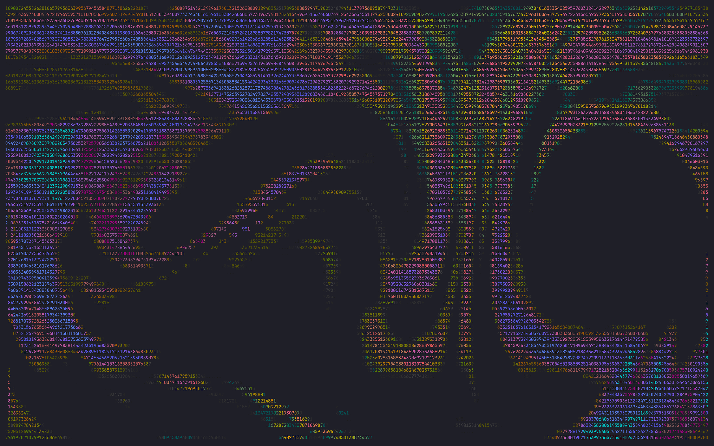

# Vortex

An [Omarchy](https://omarchy.org/) bar plugin that opens animated ASCII fluid art in your terminal: thirteen patterns (cyclones, ocean currents, rising smoke, Jupiter's storm, falling matrix digits and more) drawn with digits, in monochrome or six color palettes.



These are artistic flow fields, not scientific simulations. The animation is a single standard-library Python script, `vortex.py`, which also runs on its own in any terminal. A browser version lives in [c4pt0r/cloud](https://github.com/c4pt0r/cloud).

## Requirements

Everything below ships with a standard Omarchy install:

- Omarchy with shell plugins (`omarchy plugin` commands)
- Python 3.9+ with the standard `curses` module
- A terminal launched through `xdg-terminal-exec` (Foot, Alacritty, Ghostty, Kitty)
- `hyprctl`, `jq` and `socat`, used by the launcher to focus an existing window and to float, center or fullscreen a new one

Color needs a 256-color terminal. No packages are installed and nothing runs with `sudo`.

## Install

```bash
omarchy plugin add https://github.com/c4pt0r/vortex.git --enable
```

The widget lands in the right section of the bar. Move it with `omarchy bar move c4pt0r.vortex --section left`.

## Use

- **Left click**: open the configured pattern in a centered floating window.
- **Right click**: open a random pattern.
- Clicking while Vortex is open focuses the existing window.

Inside Vortex:

| Key | Action |
| --- | --- |
| **H** or **?** | Help panel with every shortcut and the current state |
| **O M C J S V K T Y L W N X** | Ocean, monsoon, cyclone, Jupiter, smoke, river, shear, turbulence, taichi, solution, whirlpool, nebula, matrix |
| **Tab** | Next pattern |
| **1–9** | Vortex count / complexity |
| **R** | Remix the field |
| **Space** | Motion / still |
| **+ / -** | Speed |
| **P** | Color on / off |
| **[ / ]** | Previous / next palette: psychedelic, acid, sunset, aurora, deepsea, phosphor |
| **I** | Status line |
| **Q** / **Esc** | Quit (Esc closes the help panel first) |

The window uses the app id `org.omarchy.vortex`, so Hyprland window rules can target it.

## Settings

Settings are fields on the widget's entry in `~/.config/omarchy/shell.json`:

```json
{ "id": "c4pt0r.vortex", "mode": "jupiter", "count": 3, "speed": "0.7", "color": "deepsea", "window": "float", "size": "medium", "hud": false, "mono": false }
```

| Key | Values | Default |
| --- | --- | --- |
| `mode` | `random` or a pattern name | `cyclone` |
| `count` | 1–9 | `3` |
| `speed` | `0.3`, `0.5`, `0.7`, `1.0`, `1.5`, `2.0` | `0.7` |
| `color` | `off` or a palette name | `off` |
| `window` | `float` (centered), `tiled`, `fullscreen` | `float` |
| `size` | floating size: `small` (50% of the monitor), `medium` (65%), `large` (80%) | `small` |
| `hud` | show the status line | `false` |
| `mono` | basic monochrome attributes | `false` |

The plugin never edits your configuration; it only reads these fields.

## Update

```bash
omarchy plugin update c4pt0r.vortex
```

## Remove

```bash
omarchy plugin remove c4pt0r.vortex
```

This removes the widget from the bar and deletes `~/.config/omarchy/plugins/c4pt0r.vortex`.

## Run without Omarchy

```bash
python3 vortex.py --mode cyclone --color psychedelic
```

Options: `--mode`, `--count 1-9`, `--speed 0.1-3`, `--fps 1-60`, `--aspect 0.2-1` (character width / height), `--color PALETTE`, `--no-hud`, `--mono`. Works on Linux and macOS.

## Tests

```bash
python3 -m unittest discover -s tests -v
```

## License

[MIT](LICENSE)
